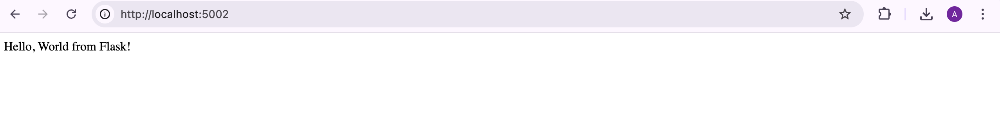
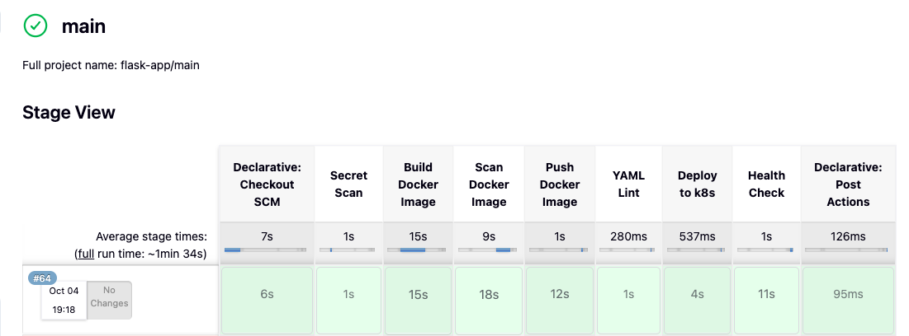

# devops-project

This repository contains the source code and configuration for the FDO (Fake DevOps) application. It includes the Python application, infrastructure as code (IaC) using Terraform, Kubernetes deployment manifests, and Jenkins pipeline definitions.

## Table of Contents

- [Project Structure](#project-structure)
- [Getting Started](#getting-started)
  - [Prerequisites](#prerequisites)
  - [Installation](#installation)
- [Usage](#usage)
  - [Running the Application Locally](#running-the-application-locally)
  - [Deploying the Infrastructure](#deploying-the-infrastructure)
  - [Deploying the Application](#deploying-the-application)
- [CI/CD](#cicd)

## Project Structure

```
/devops-project/
├───app.py
├───docker-compose.yaml
├───Dockerfile
├───Jenkinsfile
├───README.md
├───requirements.txt
├───common-libraries/
│   └───vars/
│       ├───appDeploy.groovy
│       ├───dockerBuild.groovy
│       ├───dockerPush.groovy
│       ├───dockerScan.groovy
│       ├───healthCheck.groovy
│       ├───manageTlsSecret.groovy
│       ├───secretScan.groovy
│       └───yamlLint.groovy
├───Infra/
│   ├───provider.tf
│   ├───env/
│   │   └───dev/
│   │       ├───backend.tf
│   │       ├───main.tf
│   │       ├───outputs.tf
│   │       └───variables.tf
│   └───modules/
│       ├───doks/
│       │   ├───main.tf
│       │   ├───outputs.tf
│       │   └───vairables.tf
│       ├───registry/
│       │   ├───main.tf
│       │   ├───outputs.tf
│       │   └───variables.tf
│       └───vpc/
│           ├───main.tf
│           ├───outputs.tf
│           └───variables.tf
└───k8s/
    └───deployment.yaml
```

## Getting Started

### Prerequisites

- Python 3.11
- Docker
- Terraform
- kubectl
- Jenkins
- aws cli installed
- **DigitalOcean Spaces Bucket:** Before you can apply the Terraform configuration, you need to create a DigitalOcean Spaces bucket to store the Terraform state. You will also need to create an access key and secret key for the bucket.

### Installation

1.  **Clone the repository:**

    ```bash
    git clone <repository-url>
    cd devops-project
    ```

## Usage

### Local Development Environment

**Note for macOS users:** Port 5000 is often used by macOS Control Center. To avoid conflicts, we've configured Docker Compose to expose the application on host port 5002.

To set up your local development environment, you can use Docker Compose. This will build the Docker image, map container port 5001 to host port 5002, and mount the source code for live reloads.

1.  **Build and run the application with Docker Compose:**

    ```bash
    docker-compose up
    ```

2.  **Access the application:**

    Once the application is running, you can access it in your web browser at `http://localhost:5002`. The application inside the container will be running on port 5001.



### Running the Application Locally (without Docker)

To run the Python application locally without Docker, you can use the following commands:

```bash
pip install -r requirements.txt
```

```bash
python app.py
```

### Configuration

Before applying the Terraform configuration, you need to update the following files:

#### `Infra/env/dev/backend.tf`

This file contains the configuration for the Terraform backend. You need to update the following values:

-   `bucket`: The name of your DigitalOcean Spaces bucket.
-   `key`: The path to the Terraform state file in your bucket.
-   `endpoints.s3`: The endpoint for your DigitalOcean Spaces bucket.

#### `Infra/env/dev/terraform.tfvars`

This file contains the variables for the `dev` environment. You need to update the following values:

-   `region`: The region where you want to create your resources.
-   `vpc_name`: The name of your VPC.
-   `vpc_cidr`: The CIDR block for your VPC.
-   `cluster_name`: The name of your DOKS cluster.
-   `node_size`: The size of the nodes in your DOKS cluster.
-   `node_count`: The number of nodes in your DOKS cluster.
-   `k8s_version`: The DOKS kubernetes version.
-   `registry_name`: The name of your container registry.
-   `kubeconfig_output_path`: The path where the kubeconfig file will be saved locally.

### Deploying the Infrastructure

The infrastructure is managed using Terraform. To deploy the infrastructure, follow these steps:

1.  **Export your DigitalOcean API token and Spaces credentials:**

    ```bash
    export DIGITALOCEAN_TOKEN="your_digitalocean_api_token"
    export AWS_ACCESS_KEY_ID="your_spaces_access_key"
    export AWS_SECRET_ACCESS_KEY="your_spaces_secret_key"
    ```

2.  **Navigate to your `dev` environment directory:**

    ```bash
    cd Infra/env/dev
    ```

3.  **Initialize Terraform:**

    This will initialize the backend and download the necessary providers.

    ```bash
    terraform init
    ```

4.  **Plan the changes:**

    This will show you what resources Terraform will create, modify, or destroy.

    ```bash
    terraform plan
    ```

5.  **Apply the changes:**

    This will apply the changes and create the resources in your DigitalOcean account. You will be prompted to enter the Kubernetes version. The generated `kubeconfig` file will be saved in the path specified by `kubeconfig_output_path` in `terraform.tfvars`.

    ```bash
    terraform apply
    ```

### Deploying the Application

The application is deployed to Kubernetes using Jenkins. The deployment manifest is located in the `k8s` directory.

#### Variable Substitution in `deployment.yaml`

The `k8s/deployment.yaml` file uses several placeholders that are dynamically replaced by the Jenkins pipeline during deployment:

-   `${serviceName}`: Replaced with the name of the service (e.g., `flask-app`). This is derived from the `JOB_NAME` jenkins pipeline name.
-   `${DO_REGISTRY_HOST}`: Replaced with the DigitalOcean Container Registry host. This comes from the `DO_REGISTRY_HOST` environment variable, which is a Jenkins credential.
-   `${version}`: Replaced with the Docker image version.
-   `${INGRESS_URL}`: Replaced with the Ingress URL for the application, passed as a Jenkins parameter.
-   `${TARGET_NAMESPACE}`: Replaced with the target Kubernetes namespace, passed as a Jenkins parameter.
-   `${TLS_CRT_BASE64}`: Replaced with the base64 encoded TLS certificate, provided via Jenkins credentials.
-   `${TLS_KEY_BASE64}`: Replaced with the base64 encoded TLS private key, provided via Jenkins credentials.

These substitutions ensure that the Kubernetes manifests are tailored to the specific deployment environment and build details.

## CI/CD

This project uses a Jenkins Multibranch Pipeline for CI/CD. The `Jenkinsfile` in the root directory defines the pipeline.

## Pipeline
Here is an overview of the Jenkins pipeline:


## Prerequisite
1. Nginx Ingress Controller is installed from marketplace
2. DOKS cluster has access to container registry 

### Jenkins Credentials

The following credentials need to be created in Jenkins:

| ID                       | Name                     | Description                                         |
| ------------------------ | ------------------------ | --------------------------------------------------- |
| `GITHUB_CRED`            | `GITHUB_CRED`            | GitHub username and password credentials.           |
| `container_registry_creds` | `container_registry_creds` | Credentials for the container registry.             |
| `digitalocean_registry`  | `digitalocean_registry`  | DigitalOcean container registry host.               |
| `kubeconfig`             | `kubeconfig (kubeconfig)`| The Kubernetes configuration file.                  |
| `tls_crt`                | `tls_crt`                | The TLS certificate.                                |
| `tls_key`                | `tls_key`                | The TLS private key.                                |

### Jenkins Parameters

The following parameters can be passed to the Jenkins pipeline:

| Name            | Default Value        | Description                                                 |
| --------------- | -------------------- | ----------------------------------------------------------- |
| `K8S_NAMESPACE` | `default`            | The target Kubernetes namespace for deployment.             |
| `MANIFEST_PATH` | `k8s/deployment.yaml` | The path to the Kubernetes manifest file (e.g., deployment.yaml). |
| `INGRESS_URL`   | `demo.anmol.site`    | The Ingress URL for the application.                        |

### Pipeline Stages

The pipeline consists of the following stages:

1.  **Secret Scan:** Scans the codebase for any hardcoded secrets using `gitleaks`.
2.  **Build Docker Image:** Builds a Docker image of the application.
3.  **Scan Docker Image:** Scans the Docker image for vulnerabilities using `trivy`.
4.  **Push Docker Image:** Pushes the Docker image to the DigitalOcean container registry.
5.  **YAML Lint:** Lints the Kubernetes manifest files using `yamllint`.
6.  **Deploy to k8s:** Deploys the application to the Kubernetes cluster.
7.  **Health Check:** Checks the health of the deployed application.

The pipeline uses shared libraries defined in the `common-libraries` directory.
